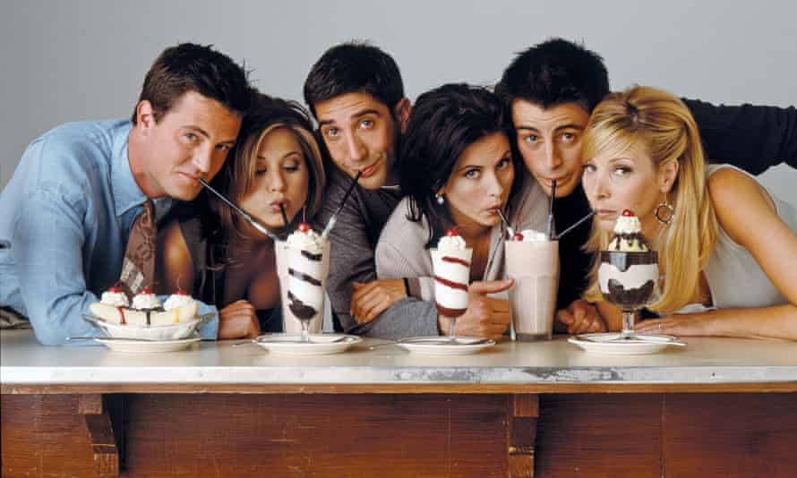

# Tasty TV Promotional Website.

A static website for a fictional streaming company.
Created using Javascript, HTML & CSS.

## Table of contents

- [Introduction](#introduction)
- [Technologies & Imagery Used](#technologies-used-&-imagery-used)
- [Launch](#launch)
- [To Do](#to-do)
- [List Of Known Issues](#list-of-known-issues)
- [Lessons Learnt](#lessons-learnt)

### Introduction

Tasty TV's website was created as a training project. It is the first project for my online course. It's here to evaluate my ability with the programming languages used. Whilst also assessing my ability to deliver on the deliverables from a 'clients brief'

### Technologies Used & Imagery Used

- Javascript
- HTML
- CSS

Codesandbox was the platform used during the creation.

#### These are the images I used for the social media platform links.

[]
[
[
[

#### These are the images I used for the companies social media content

[
[
[
[
[
[

####These are the images used for other effects e.g. photo of companies ceo & announcements

[
[
[

### Launch

URL: (https://csb-4k3wz-5fdnsosxm-clive07.vercel.app/)

I believe that since it is a mere static website nothing is particularly needed. You could copy from the Code drop down menu and open up a new sandbox on Codesandbox to examine more thoroughly.

### To Do

- check out the days streaming schedule
- check out any announcements by the company
- look into the company on the about us page
- get a random movie or tv show recommendation
- 'register' to the companies on demand + streaming service

### List Of Known Issues

The fundamental issue I faced was wanting to add too much flair when the time restrictions made it near impossible.

- NAVBAR'S MODULISATION

If you examine through the code you will see that the navbar has been created in a modular fashion.

each page executes the navbar.js script which holds a document.write() which contains a single line of all the span's and links of the navbar.

Although useful in the sense that I was able to have the one bar all pages used so that any tweaks would be instantly implemented. The format of it being all in a single line made it untidy and not very presentable for humans to read.

- LACK OF HEADER & FOOTER MODULISATION

Along a similar note to the point above. My header and footer's for each page, although identical, are not made in a modular fashion. I have copy and pasted each one to the next page. Adjusting the subTitle for each one appropriately.

Although this works. It is also repeatable code which could have been avoided if I used an adequate modularising method. However only being familar with document.write() and the time crunch I decided to move past this to ensure the project would be completed on time.

- NO ADDITIONAL DAYS SCHEDULED

On the scheduling page which shows the multimedia to be aired 'today'. I also wished to have buttons you can click to reveal the schedule for tomorrow and the next day.

This would've simply replaced the images and titles within each timeslot with the appropriate one for the day that was selected by the user.

This isn't a major issue as it is an expansion on one of the deliverables but regardless I would have still liked to of been able to implement this feature.

- NO ADDITIONAL INFORMATION ON THE RECOMMENDATIONS

My first thought for the recommendation feature was not only to suggest a show/movie but to also present its poster and video of its trailer or at least a link to it.

However time restraints made it so this additional creativity was unable to be added.

### Lessons Learnt

I realise I have a habit of overdoing things and going the extra mile when it is quite unnecassary. The priority of a project is giving the wanted deliverables. A fancy or creative site is nice however it is useless if it doesn't actually deliver on what it needs to do.

A great example of this is with the recommendation button. The deliverable is to have an option to ask for a randomly selected movie or tv show.

My initil thought was to add an image, details about it and even a video of the trailer. Now whilst all of that would be impressive... nowhere does it state it has to do these things. Only give the user a random movie or tv show.

To summarise. It is all well and good being able to create complex sites but if it isn't what was actually asked of you then time has been completely wasted.
